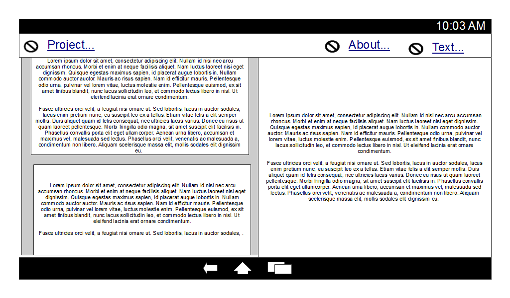

% Sofer - A Mobile Application for Etext Transcription 
% Michael McDermott
% January 31, 2015

In my time, I have transcribed a few etexts for Project Gutenberg, mostly in the
area of more obscure authors and topics that do not have convenient etexts
available. Moreso if texts are available neither as free downloads nor as paid
ebooks through the major sellers.

My time to sit at a PC and explicitly work on these texts has only gone down
with time. However, I find myself frequently fiddling with my phone and it is
seldom anything of worth. Why not take some of that time that I am doing nothing
of consequence while waiting and funneling it into transcribing etexts?

That is the fundamental goal of Sofer.

## Platform ##

My mobile devices are all Android, at the moment. A relatively recent phone and
a lower-end tablet. My primary platform will be Android, but I want to write the
application in such a way as creating iOS builds will be a matter of building
and testing.

Therefore, the long-term platform goal is to support all major smartphone and
tablet manufacturers.

## Overview ##

Generally speaking, I have found transcription to follow a workflow not unlike
the following:

Some of these steps may be optional. For example, it may be that no OCR engine
is available or that the sample was not workable with OCR.

## Screen Layouts ##

In the mockups that follow, a simple forbidden icon is used to indicate an
unspecified icon. That is to say, the icon's precise appearance is not dictated
in the mockup, but its presence is.

Due to the intrinsic difficulty in determining the precise device type being
used, the "tablet" view will always be displayed for landscape oriented devices
and the "phone" view will always be displayed for portrait oriented devices.

Throughout, the expectation is that the converted etext will be compiled in
Markdown. There are several reasons for this. First, components are common for
Markdown editors and the syntax is well-known. This makes it a prime candidated
right off the bat. The second reason is that Pandoc allows for ready conversion
of Markdown, both to other lightweight text-markup languages (like reStructured
Text, which is favored by Project Gutenberg) and to other, more sophisticated
destinations (like PDF and Word document).

### Main Screen / About Dialog ###

Upon starting the application, the main screen should be displayed. The last
transcription project should be loaded, if one already exists. The basic
workspace should have the following layout:

The left-most pane should display the selected scanset (it should be possible to
have multiple scansets associated with a single text conversion; this is most
likely when one set of scans is less than ideal and is supplemented by a second
set of scans).

The right-hand pane should be a Markdown editor that displays the text as
currently provided by the user. Proper syntax-highlighting of the Markdown text
should be provided.

Finally, the top bar should provide menu options for various common operations
that the user may need to take.

The phone view of this same screen would have the following layout:

In both mockups, the items in the toolbar expand out to menus. In the latter
mockup, the Source, Text and About items are in an accordion view in order to
save space. Figures demonstrating the expansions of the other tabs are
demonstrated below.

Since the third and final accordion for the phone is a replacement for the About
dialog, both will be displayed below, in sequence.

The hyperlink in the dialog should navigate to
http://opensource.org/licenses/MIT. Any navigations that need to be added to
comply with the licenses of libraries used in development should be added here.
If it ever becomes necessary (and it would be preferrable for it not to), a
scrollbar will be considered acceptable.

### Project Operations ###

Project operations are those options that are exposed from the Project menu.

Clicking the Save option should cause the project to be saved. The total format
of the project save format is not included in this document, but it is a
requirement that all artifacts of the project, including configuration, scans
and output texts should be saved a single file for simple portability.

### Text Operations ###

Aside from the controls to be used on the text editor and the PDF viewer, the
text operations might be the most commonly used controls in the application.

The menu itself, for both phone and tablet views is displayed below:

We will address each of the features exposed by this menu in turn.
